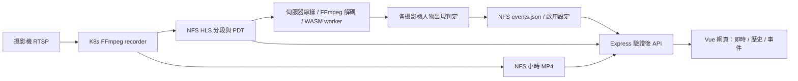

# CamPlatform 系統規格

更新日期：2026-10-04。此文件描述 repo 的實作與正式環境設定；部署驗證紀錄另見 [驗收紀錄](./VERIFICATION.md)。設定與限制改變時，必須同步更新本文件。帳密、JWT key、攝影機連線憑證不得寫入文件。

## 1. 使用目的與範圍

提供客廳 `cam1`、大門 `cam2` 的即時監看、歷史錄影與人物事件回放。伺服器持續從攝影機串流取樣辨識人物，保存事件時間；使用者不需維持瀏覽器開啟。事件不是身分辨識，也不是逐人追蹤或一般像素異動偵測。

必要行為：

1. 每支攝影機可啟用／停用伺服器人物偵測；設定保存於伺服器，跨登入、裝置及程序重啟保留。
2. 關閉網頁、背景分頁、登出、切換至歷史影像／人物事件頁，不改變伺服器偵測狀態。
3. 確認人物出現後保存攝影機、影像時間、人數與分數，所有授權裝置讀取同一份事件。
4. 事件可依攝影機與日期查詢，點選自動播放事件前後各 10 秒，在片段終點停止。
5. 畫面顯示偵測狀態、最近分析時間與最近事件；來源中斷、分析異常或資料過期時，不能假裝仍正常監控。

## 2. 架構與資料流

| 元件 | 現況與責任 |
| --- | --- |
| Vue 3 / Vite | 顯示登入、影片、伺服器偵測狀態、事件與回放；不在瀏覽器執行人物模型 |
| Express 5 / Node 22 | 身分驗證、媒體存取、事件 API、啟動常駐偵測服務 |
| Node worker_threads / TensorFlow.js WASM | 在 API 主執行緒以外載入及執行 COCO-SSD；各攝影機共用模型並依序分析 |
| FFmpeg recorder | 持續錄影與產生 HLS；由另一個 Deployment repo 管理 |
| NFS | 持久保存影片與事件；API 的影片掛載唯讀，只有事件子目錄可寫 |
| Nginx / Ingress / Cloudflare | HTTPS 同源入口，API 與影像導向 backend，靜態頁面導向 frontend |

偵測在 backend 啟動後自動開始，不由 HTTP 請求或瀏覽器連線觸發。backend 仍為單副本 `Recreate`，同時維持 JWT session 及事件儲存單一寫入者。程序重啟／部署期間會暫停偵測，恢復後從新的即時影格繼續；本版不補掃停機期間的歷史影像。

## 3. 人物偵測

### 3.1 模型與取樣

- 模型為 COCO-SSD `lite_mobilenet_v2`，TensorFlow.js / WASM 4.22。WASM 單執行緒執行，不需要 GPU、瀏覽器或另一組 RTSP 連線。
- `scripts/download-person-model.js` 固定官方模型 URL 與各檔案 SHA-256；建置 server image 時下載並驗證，包入 `/app/models/person`。正式執行不下載模型，也不把影像送至模型供應商。
- 輸入為現有 `/data/<cameraId>/hls/stream.m3u8` 及已列入 playlist 的本機 MPEG-TS 分段。驗證安全檔名、檔案型別與大小；不跟隨 symlink，不接受任意網路來源或路徑。
- FFmpeg 解碼為 320 × 180 RGB 影格，保留原始比例並補邊；模型依序辨識各攝影機。預設每輪結束等待 2 秒，實際頻率受 HLS 分段長度、攝影機數量、CPU 與解碼耗時影響。這是持續取樣，不是逐幀分析。
- 每個分段的實際檔案 mtime 必須在過去 30 秒至未來 5 秒內；即使 PDT 看似新鮮，舊檔案也不能冒充即時影格。
- 優先使用 HLS `EXT-X-PROGRAM-DATE-TIME` 加取樣位置，支援 FFmpeg 的 `+0800`、ISO `+08:00` 與 `Z`。若 PDT 缺失、無效或推算影格時間超出上述範圍，改以「分段 mtime − 分段剩餘長度」估算取樣時間，並標記 `estimated`；估算結果也必須符合新鮮度範圍。檔案時間包含傳輸、編碼及寫入延遲，不能視為精確拍攝時間。
- 相同實體影格不重複送入事件判定，時間來源切換也不能讓同一影格變成第二筆觀察；不以 API 收到請求的時間替代影像時間。
- NFS 播放清單原子換檔可能使快取檔案資訊與新開啟檔案不同步；遇到檔案已更新、讀取不完整或短暫不存在時，每個檔案最多重新讀取三次、間隔 25ms。每次仍驗證路徑、symlink、檔案大小與讀取前後一致性；持續失敗會回報異常並重試。
- 解碼與模型有容量、逾時及停止限制；失敗採有上限的延後重試。主 API 保持可回應，故障不形成無限影格佇列。

### 3.2 事件判定

- 僅採用 `class=person` 且分數至少 0.6 的結果。
- 連續兩個新的有效取樣看到人物才確認出現；事件時間使用這次連續陽性取樣的起始影像時間。任一確認取樣使用估算時間，整筆事件即標記 `estimated`。
- 連續三個有效取樣未見人物才結束目前出現狀態。人物持續留在畫面內不會每次取樣都新增事件。
- 每支攝影機兩次確認通知至少間隔 15 秒；事件時間回溯至首次陽性影格，因此兩筆 occurredAt 的差值不保證至少 15 秒。相同影格與既有事件 ID 不重複寫入。
- 暫停設定、來源失效與重啟不能把未成功分析的影格當作「沒有人」。保存必要的狀態與冷卻資訊，降低重啟後對同一段持續出現情況的重複通知。
- `count` 是事件取樣中辨識到的人數，`score` 是其中最高分數；它們不是人流統計或身分紀錄。

### 3.3 偵測狀態

| state | 顯示意義 |
| --- | --- |
| `disabled` | 伺服器功能未啟用，或該攝影機已被停用 |
| `starting` | 正在準備模型／第一個可分析影格 |
| `watching` | 最近有成功分析的新影格 |
| `waiting` | 等待新的、具有可信時間的影格 |
| `error` | 模型、解碼、來源或儲存失敗，需顯示狀態並依規則重試 |

前端以最近分析時間判斷新鮮度，超過 30 秒不能僅顯示正常偵測。狀態查詢失敗時保留可辨識的失聯提示，不以舊的成功回應冒充即時狀態。

## 4. 事件與設定保存

`EVENTS_ROOT/events.json` 是版本化的伺服器事件檔案，包含 `version`、各攝影機 `settings`、必要的 `checkpoints` 及 `events`。資料只由單一 backend 寫入，經序列化操作、暫存檔、fsync 及原子 rename 更新；成功保存後才發布新事件。檔案損壞／不支援版本應明確失敗，不可默默清空紀錄。

目前 snapshot 版本為 `1`，事件接受 `stream` 與 `estimated`。寫入估算事件後，回復部署也必須使用支援這兩種值的映像；先前只接受 `stream` 的版本會拒絕此事件檔案，不能直接回復至該版本或為了回復而清空紀錄。

事件資料：

| 欄位 | 定義 |
| --- | --- |
| `id` | 可去重的伺服器事件識別碼 |
| `cameraId`, `cameraName` | 攝影機識別與顯示名稱 |
| `occurredAt` | 人物出現的影像時間，UTC ISO 8601 |
| `recordedAt` | 伺服器保存事件的時間，UTC ISO 8601 |
| `count`, `score` | 人數與最高辨識分數 |
| `timing` | `stream` 為串流時間；`estimated` 為檔案時間估算，畫面與回放提示需標示 |

正式設定保留最近 **7 天、最多 20,000 筆**，超過任一限制時刪除最舊的事件。設定與必要 checkpoint 不隨事件過期刪除。查詢依事件時間倒序，日期依 `RECORDING_UTC_OFFSET` 解讀，正式值為台北 UTC+8。

事件保留時間與錄影清理政策獨立。事件存在不保證對應影片仍存在；查不到影片時必須顯示無可用錄影，不能播放另一個相近檔案。

### 舊版瀏覽器事件

舊版將最近 200 筆事件放在各瀏覽器／帳號的 localStorage，且只在可見的即時頁面進行辨識。新版不再以該資料為事件來源，也不自動把用戶端資料寫入伺服器。舊 localStorage 不主動刪除；伺服器事件從新版啟用後開始累積，不會自動補出先前未偵測的事件。

## 5. 網頁行為

- 登入後載入攝影機、伺服器偵測狀態及共享事件；預設顯示即時影像。
- 每 5 秒更新狀態與目前事件查詢。切換應用內分頁不停止後端偵測；畫面重新開啟會重新讀取伺服器保存的結果。
- 攝影機開關控制伺服器設定；保存中顯示進度、避免重複提交，保存失敗不得顯示成已生效。
- 即時畫面旁顯示人物狀態／人數、最近分析／事件時間。人物事件頁提供攝影機、日期、分頁與「回看 ±10 秒」。
- 歷史影像頁各攝影機可獨立選日期、分頁及播放；歷史播放不產生偵測事件。
- 桌面提供並列攝影機，窄螢幕改為垂直排列，控制及事件回放需可操作。

## 6. 錄影、時間與 ±10 秒回放

正式 recorder 為兩個 FFmpeg Deployment，每支攝影機單一寫入者。HLS 目標分段 3 秒、playlist 保留 10 段並附 PDT；GOP / 關鍵影格會影響實際分段長度。MP4 採時鐘對齊的小時分段，檔名為 `YYYY-MM-DD/YYYY-MM-DD_HH-MM-SS_UUID.mp4`，UUID 避免重連覆寫，背景準備跨日資料夾。

後端支援秒／分鐘／小時及部分其他安全 MP4 檔名。檔案需有完整 `ftyp / mdat / moov` 才可播放；歷史 API 區分 `ready / recording / unavailable`，未完成的 `fileUrl=null`，直接讀取回 409。舊小時／分鐘檔名無法還原不存在的精確起始時間，回放需標註估算。

事件回放以 `occurredAt ±10 秒` 查找實際涵蓋的已完成錄影，依 MP4 `mvhd` 長度裁切可播放範圍。跨檔案／午夜可依序播放多段，播放至每段終點停止／接下一段。缺少部分範圍回 `partial=true`；舊檔時間不精確回 `approximate=true`。

`pending` 表示相應 MP4 還在寫入，前端每 15 秒重新查詢；**小時錄影可能要等到該段封檔才可回放**。本版不另產生即時短片檔。缺失、已清理或不可用錄影回 `unavailable`；不把附近不相干錄影視為事件片段。

正式錄影清理由 Deployment/FFMPEG 管理：每小時第 15 分執行，剩餘空間低於 20% 才嘗試清理至 25%；至少保留最近兩個日曆日與未滿 24 小時檔案，每輪最多 12 個日期目錄。這是空間壓力政策，不保證固定 7 天影片。

## 7. API 合約

除 `/healthz`、`/readyz` 與登入外都先驗證 JWT；HEAD、Range、未知攝影機和不存在檔案也不能繞過驗證。錯誤為 `{error:{code,message}}`。

| 方法 / 路徑 | 合約 |
| --- | --- |
| `POST /api/auth/login` | JSON `{username,password}`；驗證後回 user、expiresAt、accessToken，並設定 HttpOnly Cookie |
| `GET /api/auth/me` | 登入狀態與到期時間 |
| `POST /api/auth/logout` | 撤銷該 session/token 並清除 Cookie |
| `GET /api/cameras` | `{cameras:[{id,name,liveUrl}]}` |
| `GET /api/detection` | `{enabled,retentionDays,cameras:[{cameraId,enabled,state,present,count,lastFrameAt,lastEventAt,message?}]}` |
| `POST /api/cameras/:id/detection` | 嚴格 JSON `{enabled:boolean}`；同源檢查，回傳保存後的攝影機狀態 |
| `GET /api/person-events` | 可選 cameraId、date、limit、offset；回 `{events,total,limit,offset,retentionDays}` |
| `GET /api/cameras/:id/dates` | 有錄影的日期，最新在前 |
| `GET /api/cameras/:id/records` | 可選 date、limit、offset；回 `{records,total,limit,offset}` |
| `GET /api/cameras/:id/event-clip?at=<ISO8601>` | `{status,parts,approximate,partial}`；part 含 record、startSeconds、endSeconds |
| `GET /:id/hls/:filename` | 授權後的 HLS playlist / 分段 |
| `GET /:id/api/records/:date/:filename` | 授權後 MP4；支援 HEAD、單一 Range、206、416 |
| `GET /:id/api/records` | 舊相容路由，回 records array |
| `GET /healthz` | 程序存活 |
| `GET /readyz` | 影片儲存可讀；啟用偵測時事件儲存亦須可用 |

事件及錄影清單預設 limit=50、上限 100，offset 為非負整數；前端每頁 50 筆事件。日期要求有效 `YYYY-MM-DD`，未知攝影機／不合法參數應明確回 4xx。API 不提供由瀏覽器任意新增「已偵測事件」的路由。

## 8. 身分與權限

目前單一管理帳號，密碼由 scrypt hash 驗證，JWT 固定 HS256 並檢查 issuer、audience、subject、expiry 與 session allowlist。前端使用 HttpOnly、SameSite=Strict、Secure、Path=/ Cookie；API client 可用 Bearer。token 不接受 query string，不存前端 sessionStorage。

正式 `PUBLIC_ORIGIN` 為 `https://nightwatch.hackdog.tw`；登入、登出及變更偵測設定檢查 Origin。預設登入期限 1 小時；登入限制同一連線來源每 60 秒 20 次，不信任任意 X-Forwarded-For。部署／重啟會清空記憶體 session，需要重新登入，但不清空持久事件及偵測設定。

影片與 API 均送出 private/no-store，不公開任意檔案目錄。登入帳密與 JWT key 由既有 Kubernetes `camplatform-auth` Secret 提供，持續偵測改動不輪替這些值。多帳號、角色與逐攝影機權限未實作。

## 9. 設定與部署

| 設定 | 預設 / 正式值 | 意義 |
| --- | --- | --- |
| `DATA_ROOT` | `/data` | 唯讀影片根目錄 |
| `CAMERA_IDS` | `cam1,cam2` | 允許的攝影機 |
| `RECORDING_UTC_OFFSET` | `+08:00` | 錄影檔名與查詢日期的時區 |
| `DETECTION_ENABLED` | 本機 false / 正式 true | 常駐偵測主開關 |
| `EVENTS_ROOT` | `/events` | 可寫事件目錄，必須與影片根目錄分開 |
| `DETECTION_INTERVAL_MS` | 2000 | 每輪分析後的等待時間 |
| `EVENT_RETENTION_DAYS` | 7 | 事件保存天數 |
| `EVENT_MAX_COUNT` | 20000 | 事件總筆數上限 |
| `JWT_SECRET`, `AUTH_USERNAME`, `AUTH_PASSWORD_HASH` | 外部 Secret | 必要登入設定，不提供可登入的預設值 |
| `COOKIE_SECURE`, `PUBLIC_ORIGIN` | true / HTTPS 正式入口 | 正式同源及 Cookie 保護 |

正式 namespace 為 `ffmpeg`，backend 固定 `slave02`、UID/GID 1000、非 root、唯讀 root filesystem、無 service-account token。`/data` 唯讀掛載既有 `nfs-data-pvc`；同 PVC 的專用 `camplatform-events` 子目錄以 subPath 可寫掛載 `/events`。init container 僅準備該事件子目錄，不遞迴修改錄影權限。

backend request 為 300m CPU / 384Mi RAM，limit 為 1500m / 1536Mi。保持一個副本和 Recreate；不允許兩個 Pod 同時寫同一份事件檔。NFS 可用性及備份由既有叢集維運負責，原子檔案更新不是備份或高可用。

| Argo Application | Deployment repo 路徑 |
| --- | --- |
| `cam-platform-prod-server` | `CamPlatform/charts/cam-platform-server` + `CamPlatform/environments/prod/server-values.yml` |
| `cam-platform-prod-frontend` | `CamPlatform/charts/cam-platform-app` + `CamPlatform/environments/prod/frontend-values.yml` |

來源 main CI 執行測試、typecheck、Vue build、兩個 Docker build；兩個完整 SHA images 發布成功後，原子更新 Deployment repo 的前後端 tags。server PreSync 檢查設定、影片目錄、事件目錄可寫及本機模型；frontend gate 檢查 readiness 與未登入保護。不能以 selective sync 跳過 hooks；上線要核對實際 Pod image 與 Argo revision，不能只看 Git push 成功。

本機開發：`npm ci`、建立私有 `.env`、安裝 FFmpeg、`npm run model:prepare`，設定可讀 DATA_ROOT、可寫 EVENTS_ROOT 與 `DETECTION_ENABLED=true`；以 `npm run server:dev` 配合 `npm run dev`。模型下載檔案在 `.gitignore`，不提交二進位權重。

## 10. 驗收與已知界線

必須驗證：無瀏覽器／無登入 session 時仍產生事件；重新啟動 backend 後事件與設定仍在；第二個瀏覽器可見同一筆事件；停用後停止新增、重新啟用恢復；兩鏡頭互不混淆；來源中斷、模型失敗、儲存失敗與重試可辨認；過期清理／分頁／日期正確；未登入及跨來源不能讀取或修改；±10 秒播放終點受限。

模型可能因光線、遮擋、人物大小、快速經過及取樣間隔漏報或誤報，不應視為逐幀完整檢出。PDT 與錄影起點仍受攝影機時鐘、串流緩衝與 keyframe 影響。2026-10-04 實機驗證曾觀察到 cam1 的 PDT 落後約一小時、但分段仍持續更新，因此需要明確標記的檔案時間估算；這不等於已修正攝影機時鐘或保證 ±10 秒能涵蓋所有來源延遲。這次持續偵測不新增通知推播、臉部辨識、歷史批次掃描、立即封存 20 秒短片、多副本 HA 或自動跨站備份。
